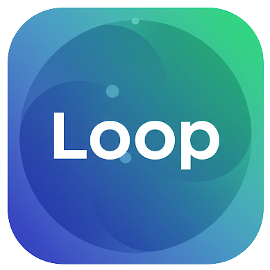
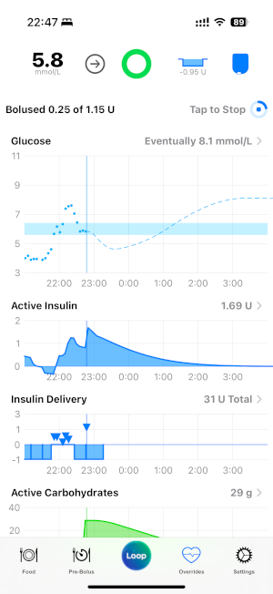
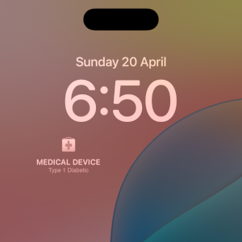

# loop-extensions

Loop (Loopkit) Extensions for T1D Looping on iOS.
This repo contains custom ectensions for the iOS looping app framework Loop/LoopKit - https://github.com/LoopKit

> Note: These extensions are in development, expermential and not approved for therapy

<br/>

For some of these extensions, the objective is to help towards providing a "one-stop-shop" for diabetes management where a single app (or as close to as possible) can be used for common tasks, aiming to make life easier for people living with T1D.

<br/><br/>


Built for: <b><font size="5">Loop v3.4.4 </font></b> 

<br/>


***NOTE: ALL CODE IN THIS REPO IS CURRENT IN DRAFT***
As extensions are added and confirmed "ready", this will be shown on this page.

<br/><br/>

## Extensions

### 1. Base UI Updates

Update to the loop GUI to:

 - Change colour scheme and include gradients in icons
 - Use custom logo (same as displayed a the top of this page)
 - Update to the bottom toolbar to use a central icon for an additional menu
 - Add text to the bottom toolbar icons and remove colour unless selected
 - Add new topbar on main chart view that is similar to navigation and move settings icon to top right corner
 - Additional views for food, overrides / custom presets, bolus



<br/><br/>

### 2. Lock Screen Widget - Medical Device

Adds a new lock screen widget that displays the text "Medical Device - Type 1 Diabetic" with an icon to show that the phone is used for medical purposes and the owner is T1D.
If the owner needs medical assistance but is unable to communicate, this may help by informing others.

Roadmap:  add an option to send the device location when loss of signal for both the pump and cgm are observed for extended time (that can be configured - defaulting to 30 minutes?). When this occurs, the device is assumpted to be away from the owner and potentially lost.



<br/><br/>

### 3. Driver Detection

If supported by the phone, a notification and optional custom preset can be enabled when the phone detects the user is travelling in a car and the current BG is below the set value.
Note, this is only an estimate and is designed to provide an additional safety control so the user is warned if BGs are at this value which is typically higher than the standard low notifications.

In NSW, Australia the legal BG for driving is 5.0mmol/L.
<i>Potentially other checks can be added to confirm user is in car such as wifi detection or BLE beacon?</i>

[Add Screenshot]

<br/>

### 4. NovoPen NFC Support - Manual Glucose Entry

While hopefully not required often, manual glucose entries are sometimes required.
This extension adds support for NovoPen 6 and NovoPen Echo Plus NFC so that the user can instead scan the pen to add recent doses.

<br/>

### 5. Pre-Bolus Timer

As an alternative to the pre-bolus preset, a timer on the status page will inform the user after entering carbs when the specified time has passed.

<br/>

### 6. Extended Charts

To better understand impact from other data on glucose, additional charts from 3rd party data can be added to the app.
Currently Garmin fitness data is only in scope.

<br/>

### 7. Diary Events and Test Results

New views for adding diary events to help record information related to T1D that might be helpful to review with a medical professional or provide insights into changes.
 - Medicine Schedule and Doses
 - Mood Score
 - Pain Sore
 - Other Observations

In addition, a view to upload an image or PDF of blood/urine test results (both regular and for a specific/new condition) that can be stored as used to help track changes, and used in report for Endo visits.
Documents will use OCR to extract data and discover results.

<br/>

### 8. Medical Appointments and Reminders

T1D management typically involves seeing multiple medical specialists and when complications are present, this can extend to even more.
This extension is used to record when new appointments have been scheduled and can provide reminders for getting blood tests, expiring referals, expiring prescriptions, etc.

Integration into Google Calendar.

<br/>


### 9. Basic Metric Display

Track and display common metrics over max 14 days:

 - TIR - Time In Range
 - TAR - Time Above Range
 - TBR - Time Below Range
 - Glucose Standard Deviation
 - Glucose Mean Aerage
 - GMI - Glucose Management Indicator (a1c Estimate)
 - CV - Coefficient of Variation
 - GV - Glycemic Variability
 - MAGE - Mean Amplitude of Glycemic Excursions
 - CONGA - Continuous Overall Net Glycemic Action

<br/>

### 10. Food / Carb Management

To help track carbs and food related metrics, this extension adds the ability to scan barcodes of food items, create meals and dose based on all items at once, use additional information such as GI load and macros to estimate the carb absorption time, feedback observed data, and help with other diet management such as daily calories.

> Integration to API required as food dataset cannot be managed in app and easily updated
> To review AI models for estimating marcos from photo

 - Potentially help with alternative choices that are better / less impact of glucose

 Although the Apple HealthKit integration for carbs is great and opens up the use of lots of apps for this, in its current implementation its limited with controlling dosing when meals are entered in other apps, and have seen issues with multiple entries within the same day.
 Pre-planning was also tricky when using MyFitnessPal as carb data is sent straight to Loop when entered.

<br/>

### 11. Reporting for Endo / GP / Other

Pending

<br/>

### 12. Automatic Estimation of Basals, ISF and Carb Ratio

Pending

<br/>

### 13. POD Placement History

When adding a new pump, the applied location on the users body can be recorded by clicking on front/back body images with recommended amd historical positions.

<br/>

### 14. Eventstream

In addition to Nightscout, events and data can be streamed to a message queue for external realtime processing.
 - Kafka?
 - AWS SQS?
 - GCP Pub/Sub?

<br/><br/>


## Installation

> Patch installation script "In Draft" - do not use

```bash
/bin/bash -c "$(curl -fsSL \
  https://raw.githubusercontent.com/benmaguire/loop-extensions/build/main/PatchScript.sh)"
```
